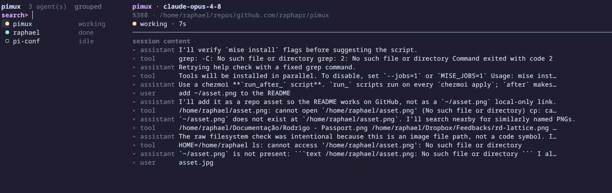

# pimux

See every [pi](https://github.com/earendil-works/pi-mono) agent across your tmux sessions, and jump to the one that needs you.

A small pi extension reports each agent's state into tmux pane options, and a popup lists every agent so you can jump in one keystroke. State comes from pi's own lifecycle events, not terminal scraping.



## State model

| State   | Meaning                                          | Dot      |
| ------- | ------------------------------------------------ | -------- |
| blocked | a prompt-style tool is waiting on you            | ● red    |
| working | turn in progress (`agent_start` → `agent_end`)   | ● yellow |
| done    | finished, not yet looked at                      | ● teal   |
| idle    | at rest / seen                                   | ○ green  |
| stale   | reported, but the pane is no longer running `pi` | ✗ struck |

`done` clears to `idle` once you focus the pane.

## Install

```sh
# 1. Binary
make install                          # -> ~/.local/bin/pimux
# or: go install github.com/raphapr/pimux@latest
# or: download a release archive from GitHub

# 2. Reporter extension (all pi sessions)
pimux install-extension               # -> ~/.pi/agent/extensions/ (override with --dir / $PIMUX_EXT_DIR)

# 3. tmux: add to tmux.conf, then reload
bind a display-popup -E -w 60% -h 60% pimux
set -g focus-events on
set-hook -g pane-focus-in 'if-shell -F "#{==:#{@pimux_state},done}" "set-option -p @pimux_state idle"'
```

The reporter is embedded in the binary, so `go install` users need no source tree. Restart pi sessions after installing it. Requires tmux ≥ 3.2 and Go ≥ 1.24 to build.

## Usage

- `prefix + a` — open the popup (use any free key).
- `pimux --json` — print discovered agents as JSON.
- `pimux --version`.

The popup search is always active: printable keys filter; control chords navigate.

| Key                               | Action                                        |
| --------------------------------- | --------------------------------------------- |
| type                              | fuzzy-filter (filter only, never reorders)    |
| `Ctrl-J` / `Ctrl-K`               | move down / up (also `Ctrl-N` / `Ctrl-P`)     |
| `Enter`                           | jump to pane and close                        |
| `Ctrl-D`                          | mark seen (`done` → `idle`)                   |
| `Ctrl-X` then `y`                 | interrupt the pane                            |
| `Ctrl-R`                          | refresh                                       |
| `Tab`                             | cycle sort: `grouped` → `priority` → `recent` |
| `Backspace` / `Ctrl-W` / `Ctrl-U` | edit / delete word / clear query              |
| `Esc`                             | clear query, else quit                        |
| `Ctrl-C`                          | quit                                          |

Sort modes (recency breaks ties in all):

- `grouped` (default): by session, most-recent first; multi-agent sessions expand to per-window rows.
- `priority`: `blocked > done > working > idle`.
- `recent`: newest activity first.

The right pane previews the selected agent's session transcript (read from its JSONL), not the live pi TUI.

## Blocked ("needs you") detection

The reporter is tool-name-agnostic and flags blocked two ways:

1. **Name patterns** — a tool whose name contains an interaction verb (`ask`, `question`, `confirm`, `permission`, `elicit`, `approve`) counts as waiting while it runs. Matching is token-aware, so `task_runner` is not tripped by `ask`. Override with `PIMUX_BLOCKING_TOOLS` (comma-separated patterns).
2. **Explicit event** — any tool or extension can flag itself, the only reliable path for prompts pimux cannot see by name:

   ```js
   pi.events.emit("pimux:blocked", {
     active: true,
     id: "deploy-gate",
     label: "approve deploy?",
   });
   // once answered:
   pi.events.emit("pimux:blocked", { active: false, id: "deploy-gate" });
   ```

## Environment

- `PIMUX_BLOCKING_TOOLS` — override the blocked-detection name patterns.
- `PIMUX_NOTIFY` — `blocked` (or `1`) to `notify-send` on block; `all` to also notify on done. Unset = off.
- `PIMUX_EXT_DIR` — target dir for `install-extension`.

## Release

Releases are built by GoReleaser on version tags.

```sh
git tag v0.1.0
git push origin v0.1.0
```

The GitHub Actions workflow runs `make test`, builds Linux and macOS archives for amd64/arm64, publishes checksums, and injects the tag into `pimux --version`.
